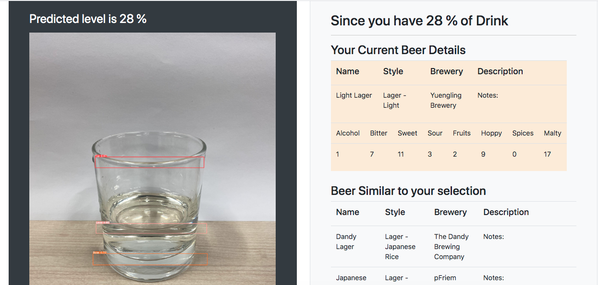
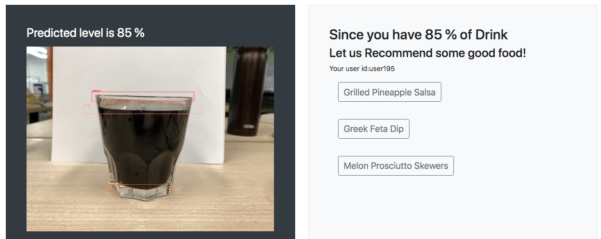
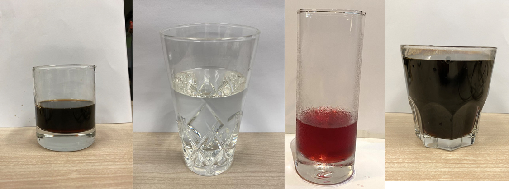

<h1>Flask App to predict % of drinks in a glass & Recommend food or drinks</h1>
<h2>Flask, Yolo-v5, Content Based & Collaborative Recommendation system</h2>

This is our final capstone project for Computer Vision and Recommendation System. Here we have trained YOLOV5 Model to detect our custome objects.We trained our model to detect top of glass, level of drink and base of drink in a glass. Once these objects in image are detected we calculate the % by dividing the distance between <b>base to level</b>/<b>base to top</b>. If % of drink is more than 50% then system recommends food using collaborative filtering and if its below 50% it recommends beers using content based filtering.

<h2>How We did it?</h2>

We took more than 500 picture of 3 Different types of drinks in 4 different types of glasses.

We labeled each images as below.

{"A?":"B","a":5,"d":"B","h":"www.canva.com","c":"DAEl8AOkUOU","i":"sIgDJbWRwYETMpahWKjIuQ","b":1628672579429,"A":[{"A?":"H","A":125.40732534154816,"B":-30.71244334209439,"D":1180.0769912969088,"C":875.2237685452072,"b":1180.0769912969088,"a":875.2237685452072,"c":[{"A?":"J","D":1180.0769912969088,"C":875.2237685452072,"a":{"D":1080,"C":801},"b":[{"A":"M0 0H1080V801H0z","B":{"A":false,"B":{"A":{"A":"MADzYHHWCeY","B":2},"B":{"A":-3.150000000000034,"D":1080,"C":807.3000000000001}}}},{"A":"M1040.064,765.645H40.936c-5.487,0-9.936-4.448-9.936-9.936V48.5h1019v707.209 C1050,761.196,1045.552,765.645,1040.064,765.645z","B":{"A":true,"I":{"A":"VAEkvwTwBj4","B":{"A":48.5,"B":-96.96222222222218,"D":1274.9244444444444,"C":717.145},"F":"B","I":true,"G":1},"E":"photo"}}]},{"A?":"J","A":9.992252741939808,"B":461.6386155031836,"D":283.03861428167755,"C":22.53791221884626,"a":{"D":150.7,"C":150.7},"b":[{"A":"M0 0h150.7v150.7H0z","B":{"C":"#ffffff"}}],"c":{"A":{"A":6,"B":6,"D":138.7,"C":138.7},"B":138.7,"C":0,"D":"A","E":"A"}},{"A?":"K","A":8.89454218469627,"B":517.2572456484544,"D":145.5625,"C":24.733333333333334,"a":{"A":[{"A?":"A","A":"makesense.ai\n"}],"B":[{"A?":"A","A":{"color":{"B":"#14110f"},"font-weight":{"B":"bold"},"font-size":{"B":"21.333333333333332"},"font-family":{"B":"YAD7Q9NigKI,0"},"text-align":{"B":"center"}}},{"A?":"B","A":12},{"A?":"A","A":{"text-transform":{"B":"none"},"leading":{"B":"1400.0"},"font-style":{"B":"normal"},"tracking":{"B":"0.0"}}},{"A?":"B","A":1},{"A?":"A","A":{"color":{"A":"#14110f"},"font-weight":{"A":"bold"},"font-size":{"A":"21.333333333333332"},"font-family":{"A":"YAD7Q9NigKI,0"},"text-align":{"A":"center"},"text-transform":{"A":"none"},"leading":{"A":"1400.0"},"font-style":{"A":"normal"},"tracking":{"A":"0.0"}}}]},"b":{"A":[13]},"d":"A","g":false}]}],"B":1920,"C":1080}

